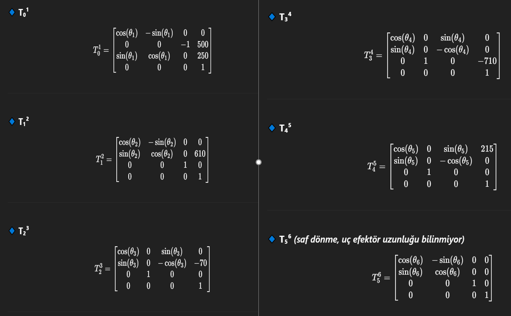

# KUKA KR160 Kinematic Control Interface

## Overview
This project implements a MATLAB-based Human–Machine Interface (HMI) and digital twin application for the KUKA KR160 industrial robot.
The system enables joint-space and Cartesian-space control using forward and inverse kinematics, without relying on a physical teach pendant.

The primary goal is to abstract industrial robot control into a software-level interface suitable for simulation, offline programming, and digital twin development.

## Features
- Forward and inverse kinematics modeling for KUKA KR160
- Joint-space and Cartesian control modes
- MATLAB App Designer–based HMI
- Real-time visualization through a digital twin approach
- Operator-independent robot control logic

## Technical Details
- Robot model defined using Denavit–Hartenberg parameters
- Kinematic transformations implemented analytically
- Modular structure separating robot model and control interface
- Designed for extensibility toward real robot communication

## Demo

## Project Status
Simulation-based implementation.
Architecture is suitable for extension to real KUKA controllers via industrial communication protocols.

